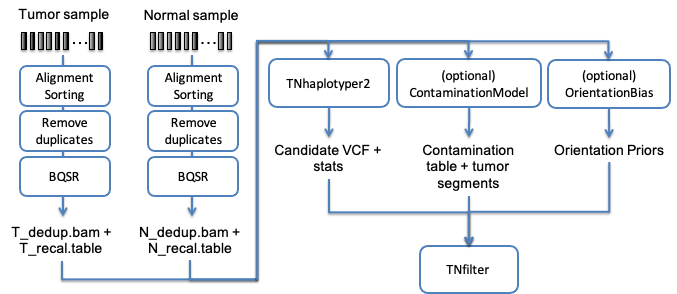

# DNA-seq workflow

This workflow is mainly based on the commercial software Sentieon. The workflow performs bioinformatics pipeline for Tumor-Normal analysis recommended in the Broad institute Somatic short variant discovery (SNVs + Indels). It uses Docker containers making installation trivial and results highly reproducible. All docker images used in the workflow are stored on XDP, and the workflow can be run on XDP directly. The following figure illustrates such a typical bioinformatics pipeline.


## Table of Contents

- [Summary](#Summary)
- [Install](#install)
- [Tools](#tools)
- [Usage](#usage)
- [To do list](#todolist)
- [Maintainers](#maintainers)
- [License](#license)

## Summary

The workflow has the following main steps:
* bwa_mem: alignment to reference genome
* get_metrics and plot_metrics: Calculate data metrics and plot the metrics
* DeDup: remove/mark duplicate reads
* realign: perform in-del realignment
* recalibration: Base quality score recalibration (BQSR).
* Somatic variant discovery, with the following stages:
    1. (Optional) Estimate the cross-sample contamination and tumor segmentation.
    2. (Optional) Estimate any possible orientation bias present in the sequencing.
    3. Somatic variant calling on the two individual BAM files: this step identifies the potential sites where the cancer genome data displays somatic variations relative to the normal genome, and calculates genotypes at that site.
    4. Filter the variants.
* Annotate variants with the SnpEff software
* HLA-I typing with optiType software
* Phasing somatic variant with germline variant and annotate phased vcf with VEP

## Install

This workflow is developed to be run on XDP without any installation.

## Tools
* sentieon, TNhaplotyper2 is used for in-del calling, TNhaplotyper2 matches the latest (currently 4.1.9) Mutect2’s result with faster speed.
* snpEff:5.0ef
* optiType:1.3.1
* GATK3:3.8-1

## Usage

Log in XDP using Google Chrome browser. Go to the section "Mine/App" and create the workflow by providing two files: the argument specification file and WDL workflow file. After creating the workflow application, workflow instance can be launched in project section.

### Files for creating workflow App on XDP
- Argument specification file: *args.detail.xlsx*
- WDL workflow file: pipeline described in [WDL](https://github.com/openwdl/wdl)

### Argument detail
- please refer to **args.detail.xlsx**

### All input files of the workflow
In this bioinformatics pipeline you will need the following inputs:
- The FASTA file containing the nucleotide sequence of the reference genome corresponding to the sample you will analyze.
- Two sets of FASTQ files containing the nucleotide sequence of the sample to be analyzed, one for the tumor sample and one for the matched normal sample. These files contain the raw reads from the DNA sequencing. The software supports inputting FASTQ files compressed using GZIP. The software only supports files containing quality scores in Sanger format (Phred+33).
- You can also include in the pipeline the following optional inputs that will help the algorithms detect artifacts and remove false positives:
    * Panel of normal VCF: list of common errors that appear as variants from multiple unrelated normal samples. The contents of this file will be used to identify variants that are more likely to be germline variants, and filter them as such.
    * Population resource VCF: list of population allele specific frequencies that will be used for filtering possible germline variants and to annotate the results.
- snpEff database, you may download corresponding annotation database according to the manual of snpEff 
- VEP-cache, please refer to http://asia.ensembl.org/info/docs/tools/vep/script/vep_cache.html#cache.
```gitignore
curl -O http://ftp.ensembl.org/pub/release-104/variation/indexed_vep_cache/homo_sapiens_vep_104_GRCh38.tar.gz
```
- VEP-plugins, Wildtype and Frameshift plugins is needed for pvacseq (https://pvactools.readthedocs.io/en/latest/pvacseq.html)


## To do list
- support CNV detection
- support TNscope,TNscope pipeline uses Sentieon’s proprietary algorithm to reach the fast speed and the highest accuracy, especially for clinical samples

## Maintainers

Email: *danny.gu@basebit.ai*

## License

[MIT © Richard McRichface.](../LICENSE)